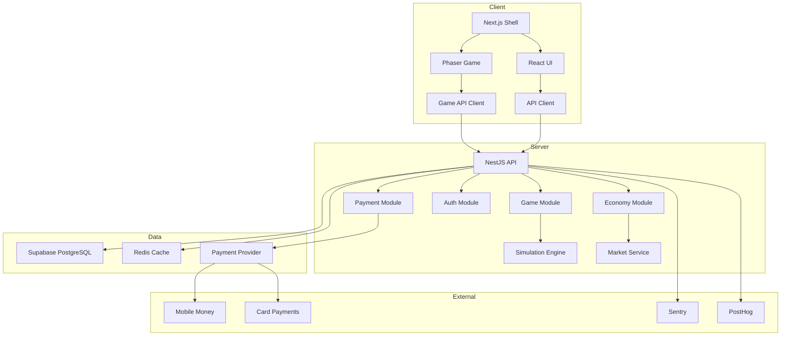
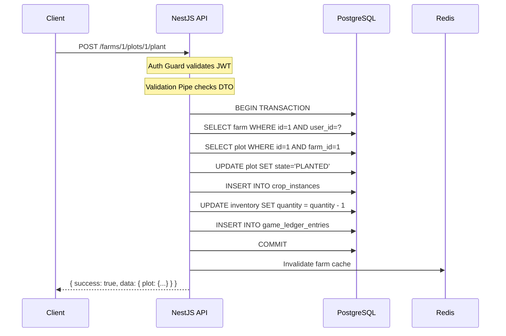
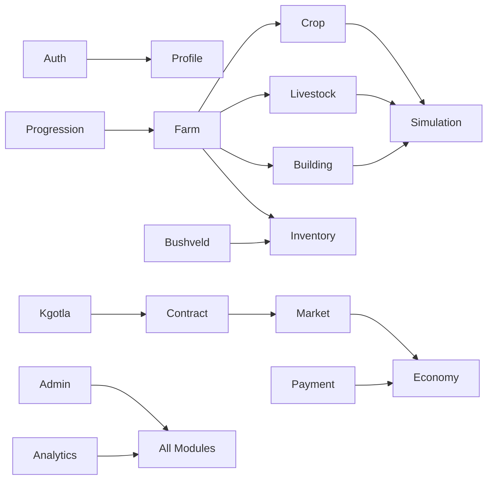
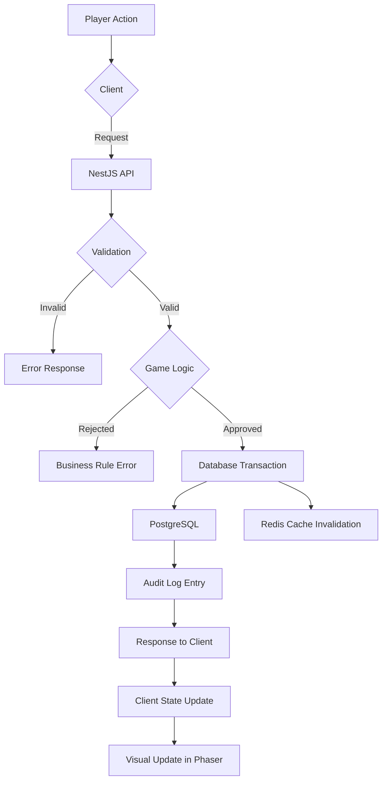
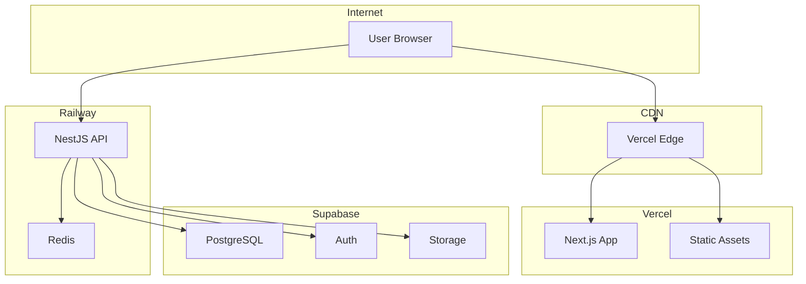

# Document 02: System Architecture Specification

> **Molemisi Farm Management Simulator**
> Version: 1.0.0
> Status: Design spec (target)
> Last Updated: 2026-09-02
> Implementation: 2026-09-06 — NestJS modular monolith + Supabase match this doc. Phaser is **not** hosted inside Next.js; Redis is unused. As-built diagram: `ARCHITECTURE_OVERVIEW.md`.

---

## Table of Contents

1. [Architecture Overview](#1-architecture-overview)
2. [System Boundaries](#2-system-boundaries)
3. [Frontend Architecture](#3-frontend-architecture)
4. [Backend Architecture](#4-backend-architecture)
5. [Database Architecture](#5-database-architecture)
6. [Infrastructure](#6-infrastructure)
7. [Communication Paths](#7-communication-paths)
8. [Trust Boundaries](#8-trust-boundaries)
9. [Data Ownership](#9-data-ownership)
10. [Failure Boundaries](#10-failure-boundaries)
11. [Architecture Diagrams](#11-architecture-diagrams)

---

## 1. Architecture Overview

**NFR-ARCH-001**

Molemisi uses a layered architecture with clear separation of concerns:

```
┌─────────────────────────────────────────────────────────────────┐
│                        CLIENT LAYER                             │
│                                                                 │
│  ┌──────────────────┐          ┌──────────────────────────┐     │
│  │   Next.js Shell  │          │     Phaser Game Client   │     │
│  │                  │          │                          │     │
│  │  • Auth UI       │          │  • Farm Scene            │     │
│  │  • Payments      │          │  • Kgotla Scene          │     │
│  │  • Settings      │          │  • Bushveld Scene        │     │
│  │  • Dashboards    │          │  • Market Scene          │     │
│  │  • PWA Shell     │          │  • Rendering             │     │
│  └────────┬─────────┘          └────────────┬─────────────┘     │
│           │                                 │                   │
│           └──────────┬──────────────────────┘                   │
│                      │                                          │
│              ┌───────▼────────┐                                 │
│              │  API Client    │                                 │
│              │  (HTTP/REST)   │                                 │
│              └───────┬────────┘                                 │
└──────────────────────┼──────────────────────────────────────────┘
                       │ HTTPS
┌──────────────────────┼──────────────────────────────────────────┐
│                      │          API LAYER                       │
│              ┌───────▼────────┐                                 │
│              │   NestJS API   │                                 │
│              │                │                                 │
│              │  ┌───────────┐ │                                 │
│              │  │ Auth      │ │                                 │
│              │  │ Module    │ │                                 │
│              │  ├───────────┤ │                                 │
│              │  │ Game      │ │                                 │
│              │  │ Module    │ │                                 │
│              │  ├───────────┤ │                                 │
│              │  │ Economy   │ │                                 │
│              │  │ Module    │ │                                 │
│              │  ├───────────┤ │                                 │
│              │  │ Payment   │ │                                 │
│              │  │ Module    │ │                                 │
│              │  ├───────────┤ │                                 │
│              │  │ Admin     │ │                                 │
│              │  │ Module    │ │                                 │
│              │  └───────────┘ │                                 │
│              └───────┬────────┘                                 │
└──────────────────────┼──────────────────────────────────────────┘
                       │
┌──────────────────────┼──────────────────────────────────────────┐
│                      │        DATA LAYER                        │
│              ┌───────▼────────┐                                 │
│              │   Supabase     │                                 │
│              │                │                                 │
│              │  ┌───────────┐ │    ┌───────────┐                │
│              │  │PostgreSQL │ │    │   Redis   │                │
│              │  │ Database  │ │    │  (cache)  │                │
│              │  └───────────┘ │    └───────────┘                │
│              │  ┌───────────┐ │    ┌───────────┐                │
│              │  │  Auth     │ │    │  Storage  │                │
│              │  └───────────┘ │    └───────────┘                │
│              │  ┌───────────┐ │    ┌───────────┐                │
│              │  │ Realtime  │ │    │  Migrations│               │
│              │  └───────────┘ │    └───────────┘                │
│              └────────────────┘                                 │
└─────────────────────────────────────────────────────────────────┘
```

---

## 2. System Boundaries

### 2.1 Client Boundary

**Scope:** Browser on player's device
**Responsibilities:**

- Render game visuals (Phaser)
- Handle user input (Phaser + Next.js)
- Manage local UI state (React)
- Display server-provided data
- Handle offline detection

**Trust level:** UNTRUSTED — all client data is validated server-side.

### 2.2 API Boundary

**Scope:** NestJS application running on server
**Responsibilities:**

- Validate all game actions
- Execute authoritative game logic
- Manage game state transitions
- Process payments
- Handle authentication/authorization
- Generate simulation results

**Trust level:** TRUSTED — this is the authoritative source.

### 2.3 Data Boundary

**Scope:** Supabase PostgreSQL + Redis
**Responsibilities:**

- Persist all game state
- Enforce database constraints
- Handle transactions
- Cache frequently accessed data
- Provide auth sessions

**Trust level:** TRUSTED — data integrity layer.

### 2.4 External Service Boundary

**Scope:** Third-party services
**Services:**

- Payment providers (mobile money, cards)
- Analytics (PostHog or similar)
- Error tracking (Sentry)
- CDN (Supabase storage / Cloudflare)

**Trust level:** EXTERNAL — all interactions require validation.

---

## 3. Frontend Architecture

### 3.1 Next.js Application

**NFR-FE-001**

The Next.js application serves as the web application shell.

**Responsibilities:**

- Authentication UI (login, register, forgot password)
- Payment processing UI
- Settings management
- Account management
- PWA service worker
- Landing pages
- Administrative dashboard (future)

**Structure:**

```
apps/
  web/                    # Next.js application
    app/                  # App Router pages
      (auth)/             # Auth routes
      (dashboard)/        # Dashboard routes
      api/                # Next.js API routes (proxy only)
    components/           # React components
    hooks/                # React hooks
    lib/                  # Utilities
    styles/               # Global styles
    public/               # Static assets
```

**Key decisions:**

- Uses App Router (not Pages Router)
- Server components for initial load performance
- Client components for interactive elements
- No game logic in Next.js — delegates to NestJS API

### 3.2 Phaser Game Client

**NFR-FE-002**

The Phaser game client handles all game rendering and interaction.

**Responsibilities:**

- 2D pixel-art rendering
- Scene management
- Sprite animation
- Input handling (point-and-click / tap)
- Camera management
- Visual effects
- Game state display

**Structure:**

```
apps/
  game/                   # Phaser game client
    src/
      scenes/             # Phaser scenes
      objects/            # Game objects
      components/         # Reusable game components
      systems/            # Game systems (rendering, input)
      services/           # API communication
      config/             # Game configuration
      utils/              # Utilities
      assets/             # Asset manifests
```

**Key decisions:**

- Uses Phaser 3 with TypeScript
- Separate from Next.js build (bundled independently)
- Communicates with NestJS API via HTTP REST
- No server-authoritative state in client — display only

### 3.3 Client Communication

```
┌──────────────────────────────────────────┐
│              Browser                      │
│                                           │
│  ┌──────────┐    ┌──────────────────┐    │
│  │ Next.js  │    │  Phaser Client   │    │
│  │  Shell   │    │                  │    │
│  │          │    │  ┌────────────┐  │    │
│  │  Auth ◄──┼────┼──┤ Game API   │  │    │
│  │  State   │    │  │ Client     │  │    │
│  │          │    │  └──────┬─────┘  │    │
│  └──────────┘    └─────────┼────────┘    │
│                            │              │
│                    ┌───────▼──────────┐   │
│                    │  Shared Auth     │   │
│                    │  Token Store     │   │
│                    └───────┬──────────┘   │
│                            │              │
└────────────────────────────┼──────────────┘
                             │ HTTPS + JWT
```

**Auth token sharing (as-built 2026-09-06):**

- Next.js handles login/registration
- Auth JWT is stored in `localStorage` (`token` and `molemisi_token`), not an httpOnly cookie
- Phaser `ApiClient` reads the same keys when the standalone client is used
- There is no `/auth/refresh` endpoint; no Next.js token-refresh shell

---

## 4. Backend Architecture

### 4.1 NestJS Modular Monolith

**NFR-BE-001**

The backend is a NestJS modular monolith. All modules run in a single process but are organized as independent modules with clear boundaries.

**Module structure:**

```
apps/
  api/                     # NestJS API
    src/
      modules/
        auth/              # Authentication & authorization
        profile/           # User profiles
        farm/              # Farm management
        crop/              # Crop system
        livestock/         # Livestock system
        building/          # Building system
        inventory/         # Inventory management
        market/            # Market & trading
        production/        # Production chains
        contract/          # Contracts
        kgotla/            # Kgotla community
        bushveld/          # Bushveld exploration
        progression/       # Leveling & skills
        simulation/        # Game simulation engine
        economy/           # Economy management
        payment/           # Payment processing
        notification/      # Notification system
        admin/             # Administration
        analytics/         # Analytics events
      common/              # Shared utilities
      config/              # Configuration
      database/            # Database entities & migrations
```

**Module communication rules:**

- Modules communicate through injected services (NestJS DI)
- No direct database access across module boundaries
- Each module owns its database tables
- Cross-module operations go through service interfaces

### 4.2 API Server

**NFR-BE-002**

**Runtime:** Node.js with NestJS
**Protocol:** HTTP/HTTPS REST
**Authentication:** JWT (Supabase Auth)
**Port:** 3001 (configurable)

**Request lifecycle:**

```
HTTP Request
  → Rate Limiter
  → Auth Guard (JWT validation)
  → Validation Pipe (DTO validation)
  → Controller (route handler)
  → Service (business logic)
  → Repository (database access)
  → Response
```

### 4.3 Background Jobs

**NFR-BE-003**

The NestJS application includes a lightweight job processing system using BullMQ + Redis.

**Job types:**

| Job                    | Frequency          | Purpose                    |
| ---------------------- | ------------------ | -------------------------- |
| `simulation-tick`      | Every 5 minutes    | Advance game simulation    |
| `market-update`        | Every 6 game hours | Update market prices       |
| `weather-update`       | Every 6 game hours | Generate weather           |
| `maintenance-check`    | Every 24 hours     | Check building maintenance |
| `notification-cleanup` | Daily              | Remove old notifications   |
| `economy-audit`        | Daily              | Verify economy integrity   |
| `analytics-flush`      | Every 5 minutes    | Batch analytics events     |

**Redis usage justification (NFR-INFRA-001):**
Redis is used ONLY for:

1. BullMQ job queue
2. Session cache (rate limiting, temporary state)
3. Market price cache (frequently updated)

Redis is NOT used for:

- Primary game state (PostgreSQL is authoritative)
- Persistent data
- Game simulation state

---

## 5. Database Architecture

### 5.1 Supabase PostgreSQL

**NFR-DB-001**

**Primary database:** Supabase PostgreSQL
**Purpose:** All persistent game data

**Key features used:**

- Tables with foreign keys
- Row Level Security (RLS)
- Database functions (for complex queries)
- Migrations (version-controlled schema)
- Backups (Supabase managed)
- Realtime (for live updates where needed)

**Connection management:**

- Connection pool via Supabase client library
- Maximum 100 connections (Supabase default)
- Connection timeout: 30 seconds
- Idle timeout: 300 seconds

### 5.2 Redis

**NFR-DB-002**

**Secondary store:** Redis (Upstash or Supabase Redis)
**Purpose:** Job queue and cache only

**Data stored in Redis:**

```
rate_limit:{ip}:{endpoint}     → request count (TTL: 60s)
market:prices                  → current prices (TTL: 300s)
simulation:queue               → pending simulation jobs
session:{user_id}              → active session data (TTL: 3600s)
```

### 5.3 Data Flow

```
Client Request
  → NestJS API
  → Service Logic
  → PostgreSQL Query (Supabase)
  → Result
  → Optional: Redis Cache Write
  → Response to Client
```

**Important:** NestJS never bypasses PostgreSQL for game state. Redis is read-through cache only.

---

## 6. Infrastructure

### 6.1 Development Environment

| Component      | Technology                | Purpose            |
| -------------- | ------------------------- | ------------------ |
| API Server     | NestJS (local)            | Development server |
| Web App        | Next.js (local)           | Development server |
| Game Client    | Phaser (bundled)          | Development build  |
| Database       | Supabase (local or cloud) | Data persistence   |
| Redis          | Local Docker              | Job queue          |
| Asset Pipeline | Webpack/Vite              | Asset bundling     |

### 6.2 Staging Environment

| Component   | Technology                 | Purpose       |
| ----------- | -------------------------- | ------------- |
| API Server  | Railway / Render           | Staging API   |
| Web App     | Vercel                     | Staging web   |
| Game Client | Vercel (static)            | Staging game  |
| Database    | Supabase (staging project) | Staging data  |
| Redis       | Upstash (staging)          | Staging queue |

### 6.3 Production Environment

| Component      | Technology                    | Purpose                |
| -------------- | ----------------------------- | ---------------------- |
| API Server     | Railway / Render              | Production API         |
| Web App        | Vercel                        | Production web         |
| Game Client    | Vercel + CDN                  | Production game assets |
| Database       | Supabase (production project) | Production data        |
| Redis          | Upstash                       | Production queue       |
| CDN            | Cloudflare                    | Static asset delivery  |
| Error Tracking | Sentry                        | Error monitoring       |
| Analytics      | PostHog                       | Product analytics      |

### 6.4 Docker Configuration

**Dockerfile (API):**

```dockerfile
FROM node:20-alpine AS builder
WORKDIR /app
COPY package*.json ./
RUN npm ci
COPY . .
RUN npm run build

FROM node:20-alpine AS runner
WORKDIR /app
COPY --from=builder /app/dist ./dist
COPY --from=builder /app/node_modules ./node_modules
COPY --from=builder /app/package.json ./
EXPOSE 3001
CMD ["node", "dist/main.js"]
```

---

## 7. Communication Paths

### 7.1 Client → API

**Protocol:** HTTPS REST
**Authentication:** Bearer JWT token
**Content-Type:** application/json
**Timeout:** 30 seconds (client-side)

**Request format:**

```
POST /api/v1/farms/{farmId}/plots/{plotId}/plant
Authorization: Bearer {jwt_token}
Content-Type: application/json

{
  "cropType": "sorghum",
  "seedId": "seed_sorghum_001"
}
```

**Response format:**

```json
{
  "success": true,
  "data": {
    "plot": {
      "id": "plot_001",
      "state": "PLANTED",
      "crop": {
        "type": "sorghum",
        "plantedAt": "2026-09-02T10:00:00Z",
        "growthStage": 0,
        "hydration": 0.5
      }
    }
  },
  "meta": {
    "serverTime": "2026-09-02T10:00:00Z",
    "farmVersion": 42
  }
}
```

### 7.2 API → Database

**Protocol:** Supabase JavaScript client / PostgreSQL direct
**Authentication:** Service role key (server-side only)
**Connection pooling:** Supabase connection pool

### 7.3 API → Redis

**Protocol:** Redis protocol (TLS)
**Authentication:** Redis password
**Library:** ioredis

### 7.4 API → Payment Provider

**Protocol:** HTTPS REST (provider-specific)
**Authentication:** Provider API key
**Webhook:** Provider → API callback URL

### 7.5 API → External Services

| Service        | Protocol   | Purpose          |
| -------------- | ---------- | ---------------- |
| Sentry         | HTTPS      | Error reporting  |
| PostHog        | HTTPS      | Analytics events |
| Email (future) | SMTP/HTTPS | Notifications    |

---

## 8. Trust Boundaries

**NFR-SEC-001**

### Boundary 1: Client ↔ API

**Trust direction:** API does NOT trust client
**Enforcement:**

- All game actions validated server-side
- All economic calculations server-side
- All state transitions server-side
- Client receives display state only

**What the client CAN do:**

- Send action requests (plant, water, harvest, buy, sell)
- Read current state
- Receive notifications

**What the client CANNOT do:**

- Modify database directly
- Bypass game rules
- Create currency
- Change item quantities
- Modify farm state

### Boundary 2: API ↔ Database

**Trust direction:** Database trusts API (service role)
**Enforcement:**

- RLS policies for player data isolation
- API uses service role for game operations
- Database constraints enforce data integrity

### Boundary 3: API ↔ External Services

**Trust direction:** API does NOT trust external services
**Enforcement:**

- All webhook payloads verified with HMAC signatures
- All payment confirmations verified with provider API
- All external data validated before use

### Boundary 4: Public ↔ Private

**Trust direction:** Public network does NOT access private network
**Enforcement:**

- Only API port exposed publicly
- Database only accessible from API
- Redis only accessible from API
- Internal services not exposed

---

## 9. Data Ownership

### 9.1 Data Categories

| Category        | Owner            | Access              | Examples                |
| --------------- | ---------------- | ------------------- | ----------------------- |
| Player Identity | Supabase Auth    | Player, Admin       | Email, auth tokens      |
| Profile         | Profile Module   | Player, Admin       | Display name, avatar    |
| Farm State      | Farm Module      | Player (own), Admin | Plots, crops, buildings |
| Inventory       | Inventory Module | Player (own), Admin | Items, quantities       |
| Economy         | Economy Module   | Server only         | Market prices, ledger   |
| Payments        | Payment Module   | Player (own), Admin | Transactions, receipts  |
| Analytics       | Analytics Module | Server only         | Events, metrics         |
| Configuration   | Config Module    | Admin only          | Game balance values     |
| Audit           | Admin Module     | Admin only          | Action logs             |

### 9.2 Data Access Patterns

**Player reads own data:**

```
Player → API (JWT) → RLS policy (user_id match) → PostgreSQL
```

**Player writes own data:**

```
Player → API (JWT) → Validation → Game logic → Service role → PostgreSQL
```

**Server modifies economy:**

```
Background job → Service role → Economy tables → Audit log
```

**Admin accesses data:**

```
Admin → Admin API (admin JWT) → Service role → Any table → Audit log
```

---

## 10. Failure Boundaries

### 10.1 Client Failures

| Failure               | Impact                  | Recovery                 |
| --------------------- | ----------------------- | ------------------------ |
| Network disconnected  | Cannot sync with server | Offline mode (read-only) |
| JavaScript error      | UI broken               | Page reload              |
| Asset loading failure | Partial rendering       | Retry loading            |
| Auth token expired    | API calls fail          | Token refresh            |

### 10.2 API Failures

| Failure               | Impact              | Recovery                    |
| --------------------- | ------------------- | --------------------------- |
| Database down         | All operations fail | Supabase auto-recovery      |
| Redis down            | Jobs delayed        | Fallback to sync processing |
| Payment provider down | Purchases fail      | Retry queue                 |
| External service down | Analytics lost      | Buffered retry              |

### 10.3 Database Failures

| Failure                   | Impact              | Recovery                      |
| ------------------------- | ------------------- | ----------------------------- |
| Connection pool exhausted | API timeouts        | Reduce concurrent connections |
| Disk full                 | Write failures      | Supabase monitoring           |
| Corruption                | Data integrity risk | Point-in-time recovery        |

### 10.4 Failure Isolation

Each system failure is isolated:

- Client failure → Server continues, player reconnects
- API failure → Client shows error, retries
- Database failure → API returns 503, client retries
- Redis failure → Jobs process synchronously
- Payment failure → Purchase cancelled, no economic impact

---

## 11. Architecture Diagrams

### 11.1 High-Level Architecture (Mermaid)



### 11.2 Request Flow (Mermaid)



### 11.3 Module Dependencies (Mermaid)



### 11.4 Data Flow Diagram (Mermaid)



### 11.5 Deployment Architecture (Mermaid)


