# Document 07: Database Design Specification

> **Molemisi Farm Management Simulator**
> Version: 1.0.0
> Status: Draft
> Last Updated: 2026-09-02

---

## Table of Contents

1. [Database Overview](#1-database-overview)
2. [Schema Design](#2-schema-design)
3. [Core Tables](#3-core-tables)
4. [Game Tables](#4-game-tables)
5. [Economy Tables](#5-economy-tables)
6. [Social Tables](#6-social-tables)
7. [Payment Tables](#7-payment-tables)
8. [System Tables](#8-system-tables)
9. [Enums](#9-enums)
10. [Indexes](#10-indexes)
11. [RLS Policies](#11-rls-policies)
12. [Migrations](#12-migrations)
13. [ER Diagram](#13-er-diagram)

---

## 1. Database Overview

**NFR-DB-001**

### Platform

- **Database:** Supabase PostgreSQL
- **Version:** PostgreSQL 15+
- **Connection:** Supabase client library (server-side)
- **Authentication:** Supabase Auth (JWT)
- **Migrations:** Supabase CLI

### Design Principles

1. **Player isolation:** All player data is isolated via `user_id` foreign keys
2. **Server authority:** Economy tables are server-only (no direct client access)
3. **Audit trail:** All economic transactions logged in `game_ledger_entries`
4. **Soft deletion:** Important records use `deleted_at` instead of hard delete
5. **Timestamps:** All tables have `created_at` and `updated_at`
6. **UUIDs:** All primary keys use UUID v4

### Access Patterns

| Access Pattern          | Who    | How                      |
| ----------------------- | ------ | ------------------------ |
| Player reads own data   | Player | API + RLS                |
| Player writes own data  | Player | API only (no direct DB)  |
| Server modifies economy | Server | Service role             |
| Admin reads any data    | Admin  | Admin API + service role |
| Background jobs         | Server | Service role             |

---

## 2. Schema Design

### Schema Organization

```sql
-- Core schemas
CREATE SCHEMA IF NOT EXISTS auth;        -- Supabase Auth (managed)
CREATE SCHEMA IF NOT EXISTS public;      -- Main game data
CREATE SCHEMA IF NOT EXISTS storage;     -- Supabase Storage (managed)

-- All game tables go in public schema
```

### Naming Conventions

- **Tables:** Plural, snake_case (`farms`, `crop_instances`)
- **Columns:** Singular, snake_case (`user_id`, `created_at`)
- **Primary keys:** `id` (UUID)
- **Foreign keys:** `{referenced_table}_id` (`farm_id`, `user_id`)
- **Timestamps:** `created_at`, `updated_at`, `deleted_at`
- **Indexes:** `idx_{table}_{columns}`

---

## 3. Core Tables

**NFR-DB-002**

### profiles

Player profile data (extends Supabase Auth users).

```sql
CREATE TABLE public.profiles (
  id UUID PRIMARY KEY REFERENCES auth.users(id) ON DELETE CASCADE,
  display_name VARCHAR(50) NOT NULL DEFAULT 'Farmer',
  avatar_url VARCHAR(500),
  farm_name VARCHAR(100) DEFAULT 'My Farm',
  farm_level INTEGER NOT NULL DEFAULT 1,
  farm_xp INTEGER NOT NULL DEFAULT 0,
  farming_skill INTEGER NOT NULL DEFAULT 1,
  farming_skill_xp INTEGER NOT NULL DEFAULT 0,
  husbandry_skill INTEGER NOT NULL DEFAULT 1,
  husbandry_skill_xp INTEGER NOT NULL DEFAULT 0,
  trading_skill INTEGER NOT NULL DEFAULT 1,
  trading_skill_xp INTEGER NOT NULL DEFAULT 0,
  currency INTEGER NOT NULL DEFAULT 100,
  energy INTEGER NOT NULL DEFAULT 100,
  max_energy INTEGER NOT NULL DEFAULT 100,
  last_active_at TIMESTAMPTZ NOT NULL DEFAULT NOW(),
  last_simulated_at TIMESTAMPTZ NOT NULL DEFAULT NOW(),
  created_at TIMESTAMPTZ NOT NULL DEFAULT NOW(),
  updated_at TIMESTAMPTZ NOT NULL DEFAULT NOW(),
  deleted_at TIMESTAMPTZ
);

-- RLS: Players can only read/update their own profile
ALTER TABLE public.profiles ENABLE ROW LEVEL SECURITY;

CREATE POLICY "players_read_own_profile" ON public.profiles
  FOR SELECT USING (auth.uid() = id);

CREATE POLICY "players_update_own_profile" ON public.profiles
  FOR UPDATE USING (auth.uid() = id)
  WITH CHECK (auth.uid() = id);
```

### farms

Farm instances (one per player).

```sql
CREATE TABLE public.farms (
  id UUID PRIMARY KEY DEFAULT gen_random_uuid(),
  user_id UUID NOT NULL REFERENCES public.profiles(id) ON DELETE CASCADE,
  name VARCHAR(100) NOT NULL DEFAULT 'My Farm',
  level INTEGER NOT NULL DEFAULT 1,
  xp INTEGER NOT NULL DEFAULT 0,
  plot_count INTEGER NOT NULL DEFAULT 4,
  max_plots INTEGER NOT NULL DEFAULT 20,
  weather_state VARCHAR(20) NOT NULL DEFAULT 'clear',
  weather_changed_at TIMESTAMPTZ NOT NULL DEFAULT NOW(),
  season VARCHAR(20) NOT NULL DEFAULT 'spring',
  season_day INTEGER NOT NULL DEFAULT 1,
  created_at TIMESTAMPTZ NOT NULL DEFAULT NOW(),
  updated_at TIMESTAMPTZ NOT NULL DEFAULT NOW(),
  deleted_at TIMESTAMPTZ,

  UNIQUE(user_id)
);

CREATE INDEX idx_farms_user_id ON public.farms(user_id);
```

---

## 4. Game Tables

**NFR-DB-003**

### farm_plots

Individual farm plots.

```sql
CREATE TABLE public.farm_plots (
  id UUID PRIMARY KEY DEFAULT gen_random_uuid(),
  farm_id UUID NOT NULL REFERENCES public.farms(id) ON DELETE CASCADE,
  slot_index INTEGER NOT NULL,
  state VARCHAR(20) NOT NULL DEFAULT 'EMPTY',
  created_at TIMESTAMPTZ NOT NULL DEFAULT NOW(),
  updated_at TIMESTAMPTZ NOT NULL DEFAULT NOW(),

  UNIQUE(farm_id, slot_index),
  CHECK (slot_index >= 0 AND slot_index < 20)
);

CREATE INDEX idx_farm_plots_farm_id ON public.farm_plots(farm_id);
```

### crop_instances

Active crops on plots.

```sql
CREATE TABLE public.crop_instances (
  id UUID PRIMARY KEY DEFAULT gen_random_uuid(),
  plot_id UUID NOT NULL REFERENCES public.farm_plots(id) ON DELETE CASCADE,
  farm_id UUID NOT NULL REFERENCES public.farms(id) ON DELETE CASCADE,
  crop_type VARCHAR(50) NOT NULL,
  growth_stage INTEGER NOT NULL DEFAULT 0,
  max_growth_stages INTEGER NOT NULL,
  hydration REAL NOT NULL DEFAULT 0.5,
  health REAL NOT NULL DEFAULT 1.0,
  fertilizer_active BOOLEAN NOT NULL DEFAULT FALSE,
  fertilizer_bonus REAL NOT NULL DEFAULT 0,
  disease_events INTEGER NOT NULL DEFAULT 0,
  pest_events INTEGER NOT NULL DEFAULT 0,
  planted_at TIMESTAMPTZ NOT NULL DEFAULT NOW(),
  last_watered_at TIMESTAMPTZ NOT NULL DEFAULT NOW(),
  expected_ready_at TIMESTAMPTZ,
  created_at TIMESTAMPTZ NOT NULL DEFAULT NOW(),
  updated_at TIMESTAMPTZ NOT NULL DEFAULT NOW()
);

CREATE INDEX idx_crop_instances_plot_id ON public.crop_instances(plot_id);
CREATE INDEX idx_crop_instances_farm_id ON public.crop_instances(farm_id);
CREATE INDEX idx_crop_instances_expected_ready_at ON public.crop_instances(expected_ready_at);
```

### livestock

Animals on the farm.

```sql
CREATE TABLE public.livestock (
  id UUID PRIMARY KEY DEFAULT gen_random_uuid(),
  farm_id UUID NOT NULL REFERENCES public.farms(id) ON DELETE CASCADE,
  animal_type VARCHAR(50) NOT NULL,
  name VARCHAR(50),
  hunger REAL NOT NULL DEFAULT 0.8,
  health REAL NOT NULL DEFAULT 1.0,
  happiness REAL NOT NULL DEFAULT 0.7,
  product_ready BOOLEAN NOT NULL DEFAULT FALSE,
  product_timer TIMESTAMPTZ,
  last_fed_at TIMESTAMPTZ NOT NULL DEFAULT NOW(),
  last_pet_at TIMESTAMPTZ,
  is_sick BOOLEAN NOT NULL DEFAULT FALSE,
  sick_since TIMESTAMPTZ,
  created_at TIMESTAMPTZ NOT NULL DEFAULT NOW(),
  updated_at TIMESTAMPTZ NOT NULL DEFAULT NOW(),
  deleted_at TIMESTAMPTZ
);

CREATE INDEX idx_livestock_farm_id ON public.livestock(farm_id);
CREATE INDEX idx_livestock_product_ready ON public.livestock(farm_id, product_ready) WHERE product_ready = TRUE;
```

### buildings

Farm buildings.

```sql
CREATE TABLE public.buildings (
  id UUID PRIMARY KEY DEFAULT gen_random_uuid(),
  farm_id UUID NOT NULL REFERENCES public.farms(id) ON DELETE CASCADE,
  building_type VARCHAR(50) NOT NULL,
  level INTEGER NOT NULL DEFAULT 1,
  state VARCHAR(20) NOT NULL DEFAULT 'ACTIVE',
  capacity INTEGER NOT NULL,
  wear REAL NOT NULL DEFAULT 0,
  construction_started_at TIMESTAMPTZ,
  construction_ends_at TIMESTAMPTZ,
  last_maintained_at TIMESTAMPTZ NOT NULL DEFAULT NOW(),
  created_at TIMESTAMPTZ NOT NULL DEFAULT NOW(),
  updated_at TIMESTAMPTZ NOT NULL DEFAULT NOW(),
  deleted_at TIMESTAMPTZ
);

CREATE INDEX idx_buildings_farm_id ON public.buildings(farm_id);
CREATE INDEX idx_buildings_state ON public.buildings(farm_id, state);
```

### inventory

Player inventory.

```sql
CREATE TABLE public.inventory (
  id UUID PRIMARY KEY DEFAULT gen_random_uuid(),
  farm_id UUID NOT NULL REFERENCES public.farms(id) ON DELETE CASCADE,
  item_type VARCHAR(50) NOT NULL,
  item_category VARCHAR(30) NOT NULL,
  quantity INTEGER NOT NULL DEFAULT 0,
  quality VARCHAR(20) NOT NULL DEFAULT 'normal',
  created_at TIMESTAMPTZ NOT NULL DEFAULT NOW(),
  updated_at TIMESTAMPTZ NOT NULL DEFAULT NOW(),

  UNIQUE(farm_id, item_type, quality)
);

CREATE INDEX idx_inventory_farm_id ON public.inventory(farm_id);
CREATE INDEX idx_inventory_category ON public.inventory(farm_id, item_category);
```

### production_jobs

Active production jobs.

```sql
CREATE TABLE public.production_jobs (
  id UUID PRIMARY KEY DEFAULT gen_random_uuid(),
  building_id UUID NOT NULL REFERENCES public.buildings(id) ON DELETE CASCADE,
  farm_id UUID NOT NULL REFERENCES public.farms(id) ON DELETE CASCADE,
  recipe_type VARCHAR(50) NOT NULL,
  input_items JSONB NOT NULL,
  output_items JSONB NOT NULL,
  progress REAL NOT NULL DEFAULT 0,
  started_at TIMESTAMPTZ NOT NULL DEFAULT NOW(),
  ends_at TIMESTAMPTZ NOT NULL,
  created_at TIMESTAMPTZ NOT NULL DEFAULT NOW(),
  updated_at TIMESTAMPTZ NOT NULL DEFAULT NOW()
);

CREATE INDEX idx_production_jobs_building_id ON public.production_jobs(building_id);
CREATE INDEX idx_production_jobs_farm_id ON public.production_jobs(farm_id);
CREATE INDEX idx_production_jobs_ends_at ON public.production_jobs(ends_at);
```

---

## 5. Economy Tables

**NFR-DB-004**

### market_prices

Current market prices (server-managed).

```sql
CREATE TABLE public.market_prices (
  id UUID PRIMARY KEY DEFAULT gen_random_uuid(),
  item_type VARCHAR(50) NOT NULL UNIQUE,
  base_price INTEGER NOT NULL,
  current_price INTEGER NOT NULL,
  demand_modifier REAL NOT NULL DEFAULT 1.0,
  supply_modifier REAL NOT NULL DEFAULT 1.0,
  season_modifier REAL NOT NULL DEFAULT 1.0,
  event_modifier REAL NOT NULL DEFAULT 1.0,
  last_updated_at TIMESTAMPTZ NOT NULL DEFAULT NOW(),
  created_at TIMESTAMPTZ NOT NULL DEFAULT NOW(),
  updated_at TIMESTAMPTZ NOT NULL DEFAULT NOW()
);

-- Server-only: No RLS (accessed via service role only)
```

### market_transactions

All market transactions (audit trail).

```sql
CREATE TABLE public.market_transactions (
  id UUID PRIMARY KEY DEFAULT gen_random_uuid(),
  farm_id UUID NOT NULL REFERENCES public.farms(id),
  transaction_type VARCHAR(20) NOT NULL,
  item_type VARCHAR(50) NOT NULL,
  quantity INTEGER NOT NULL,
  price_per_unit INTEGER NOT NULL,
  total_price INTEGER NOT NULL,
  quality VARCHAR(20) NOT NULL DEFAULT 'normal',
  created_at TIMESTAMPTZ NOT NULL DEFAULT NOW()
);

CREATE INDEX idx_market_transactions_farm_id ON public.market_transactions(farm_id);
CREATE INDEX idx_market_transactions_created_at ON public.market_transactions(created_at);
```

### game_ledger_entries

All economic transactions (audit trail).

```sql
CREATE TABLE public.game_ledger_entries (
  id UUID PRIMARY KEY DEFAULT gen_random_uuid(),
  farm_id UUID NOT NULL REFERENCES public.farms(id),
  entry_type VARCHAR(30) NOT NULL,
  reference_type VARCHAR(30),
  reference_id UUID,
  currency_change INTEGER NOT NULL DEFAULT 0,
  currency_balance_after INTEGER NOT NULL,
  item_type VARCHAR(50),
  item_quantity_change INTEGER,
  item_quality VARCHAR(20),
  description TEXT,
  metadata JSONB,
  created_at TIMESTAMPTZ NOT NULL DEFAULT NOW()
);

CREATE INDEX idx_game_ledger_farm_id ON public.game_ledger_entries(farm_id);
CREATE INDEX idx_game_ledger_created_at ON public.game_ledger_entries(created_at);
CREATE INDEX idx_game_ledger_type ON public.game_ledger_entries(entry_type);
```

### contracts

Active and completed contracts.

```sql
CREATE TABLE public.contracts (
  id UUID PRIMARY KEY DEFAULT gen_random_uuid(),
  farm_id UUID REFERENCES public.farms(id) ON DELETE CASCADE,
  contract_type VARCHAR(30) NOT NULL,
  difficulty VARCHAR(20) NOT NULL,
  title VARCHAR(100) NOT NULL,
  description TEXT,
  requirements JSONB NOT NULL,
  rewards JSONB NOT NULL,
  status VARCHAR(20) NOT NULL DEFAULT 'available',
  progress JSONB NOT NULL DEFAULT '{}',
  accepted_at TIMESTAMPTZ,
  deadline_at TIMESTAMPTZ,
  completed_at TIMESTAMPTZ,
  created_at TIMESTAMPTZ NOT NULL DEFAULT NOW(),
  updated_at TIMESTAMPTZ NOT NULL DEFAULT NOW()
);

CREATE INDEX idx_contracts_farm_id ON public.contracts(farm_id);
CREATE INDEX idx_contracts_status ON public.contracts(status);
CREATE INDEX idx_contracts_deadline ON public.contracts(deadline_at);
```

---

## 6. Social Tables

**NFR-DB-005**

### kgotla_reputation

Player reputation with Kgotla NPCs.

```sql
CREATE TABLE public.kgotla_reputation (
  id UUID PRIMARY KEY DEFAULT gen_random_uuid(),
  farm_id UUID NOT NULL REFERENCES public.farms(id) ON DELETE CASCADE,
  npc_id VARCHAR(50) NOT NULL,
  reputation INTEGER NOT NULL DEFAULT 0,
  quests_completed INTEGER NOT NULL DEFAULT 0,
  last_interaction_at TIMESTAMPTZ,
  created_at TIMESTAMPTZ NOT NULL DEFAULT NOW(),
  updated_at TIMESTAMPTZ NOT NULL DEFAULT NOW(),

  UNIQUE(farm_id, npc_id),
  CHECK (reputation >= -100 AND reputation <= 100)
);

CREATE INDEX idx_kgotla_reputation_farm_id ON public.kgotla_reputation(farm_id);
```

### bushveld_discoveries

Player discoveries in the Bushveld.

```sql
CREATE TABLE public.bushveld_discoveries (
  id UUID PRIMARY KEY DEFAULT gen_random_uuid(),
  farm_id UUID NOT NULL REFERENCES public.farms(id) ON DELETE CASCADE,
  zone VARCHAR(50) NOT NULL,
  discovery_type VARCHAR(50) NOT NULL,
  discovery_name VARCHAR(100) NOT NULL,
  discovered_at TIMESTAMPTZ NOT NULL DEFAULT NOW(),

  UNIQUE(farm_id, discovery_type, discovery_name)
);

CREATE INDEX idx_bushveld_discoveries_farm_id ON public.bushveld_discoveries(farm_id);
```

### resource_nodes

Bushveld resource node states.

```sql
CREATE TABLE public.resource_nodes (
  id UUID PRIMARY KEY DEFAULT gen_random_uuid(),
  zone VARCHAR(50) NOT NULL,
  node_type VARCHAR(50) NOT NULL,
  state VARCHAR(20) NOT NULL DEFAULT 'AVAILABLE',
  resource_type VARCHAR(50) NOT NULL,
  resource_quantity INTEGER NOT NULL DEFAULT 1,
  regenerates_at TIMESTAMPTZ,
  created_at TIMESTAMPTZ NOT NULL DEFAULT NOW(),
  updated_at TIMESTAMPTZ NOT NULL DEFAULT NOW()
);

CREATE INDEX idx_resource_nodes_zone ON public.resource_nodes(zone);
CREATE INDEX idx_resource_nodes_state ON public.resource_nodes(state);
```

---

## 7. Payment Tables

**NFR-DB-006**

### payments

Payment records.

```sql
CREATE TABLE public.payments (
  id UUID PRIMARY KEY DEFAULT gen_random_uuid(),
  farm_id UUID NOT NULL REFERENCES public.farms(id),
  user_id UUID NOT NULL REFERENCES public.profiles(id),
  provider VARCHAR(50) NOT NULL,
  provider_transaction_id VARCHAR(200),
  amount INTEGER NOT NULL,
  currency VARCHAR(3) NOT NULL DEFAULT 'BWP',
  status VARCHAR(20) NOT NULL DEFAULT 'pending',
  items_purchased JSONB NOT NULL,
  created_at TIMESTAMPTZ NOT NULL DEFAULT NOW(),
  updated_at TIMESTAMPTZ NOT NULL DEFAULT NOW(),
  completed_at TIMESTAMPTZ,
  failed_at TIMESTAMPTZ,
  failure_reason TEXT
);

CREATE INDEX idx_payments_user_id ON public.payments(user_id);
CREATE INDEX idx_payments_farm_id ON public.payments(farm_id);
CREATE INDEX idx_payments_status ON public.payments(status);
CREATE INDEX idx_payments_provider_tx ON public.payments(provider_transaction_id);
```

### payment_entitlements

What players received from payments.

```sql
CREATE TABLE public.payment_entitlements (
  id UUID PRIMARY KEY DEFAULT gen_random_uuid(),
  payment_id UUID NOT NULL REFERENCES public.payments(id),
  farm_id UUID NOT NULL REFERENCES public.farms(id),
  entitlement_type VARCHAR(50) NOT NULL,
  entitlement_data JSONB NOT NULL,
  granted_at TIMESTAMPTZ NOT NULL DEFAULT NOW(),
  created_at TIMESTAMPTZ NOT NULL DEFAULT NOW()
);

CREATE INDEX idx_payment_entitlements_payment_id ON public.payment_entitlements(payment_id);
CREATE INDEX idx_payment_entitlements_farm_id ON public.payment_entitlements(farm_id);
```

---

## 8. System Tables

**NFR-DB-007**

### notifications

Player notifications.

```sql
CREATE TABLE public.notifications (
  id UUID PRIMARY KEY DEFAULT gen_random_uuid(),
  farm_id UUID NOT NULL REFERENCES public.farms(id) ON DELETE CASCADE,
  notification_type VARCHAR(30) NOT NULL,
  title VARCHAR(100) NOT NULL,
  message TEXT NOT NULL,
  data JSONB,
  read BOOLEAN NOT NULL DEFAULT FALSE,
  created_at TIMESTAMPTZ NOT NULL DEFAULT NOW()
);

CREATE INDEX idx_notifications_farm_id ON public.notifications(farm_id);
CREATE INDEX idx_notifications_unread ON public.notifications(farm_id, read) WHERE read = FALSE;
```

### achievements

Player achievements.

```sql
CREATE TABLE public.achievements (
  id UUID PRIMARY KEY DEFAULT gen_random_uuid(),
  farm_id UUID NOT NULL REFERENCES public.farms(id) ON DELETE CASCADE,
  achievement_type VARCHAR(50) NOT NULL,
  achievement_name VARCHAR(100) NOT NULL,
  progress INTEGER NOT NULL DEFAULT 0,
  max_progress INTEGER NOT NULL,
  completed BOOLEAN NOT NULL DEFAULT FALSE,
  completed_at TIMESTAMPTZ,
  created_at TIMESTAMPTZ NOT NULL DEFAULT NOW(),
  updated_at TIMESTAMPTZ NOT NULL DEFAULT NOW(),

  UNIQUE(farm_id, achievement_type)
);

CREATE INDEX idx_achievements_farm_id ON public.achievements(farm_id);
```

### farm_statistics

Aggregated farm statistics.

```sql
CREATE TABLE public.farm_statistics (
  id UUID PRIMARY KEY DEFAULT gen_random_uuid(),
  farm_id UUID NOT NULL REFERENCES public.farms(id) ON DELETE CASCADE,
  stat_date DATE NOT NULL DEFAULT CURRENT_DATE,
  crops_planted INTEGER NOT NULL DEFAULT 0,
  crops_harvested INTEGER NOT NULL DEFAULT 0,
  crops_withered INTEGER NOT NULL DEFAULT 0,
  animals_fed INTEGER NOT NULL DEFAULT 0,
  products_collected INTEGER NOT NULL DEFAULT 0,
  buildings_built INTEGER NOT NULL DEFAULT 0,
  buildings_upgraded INTEGER NOT NULL DEFAULT 0,
  currency_earned INTEGER NOT NULL DEFAULT 0,
  currency_spent INTEGER NOT NULL DEFAULT 0,
  items_sold INTEGER NOT NULL DEFAULT 0,
  items_bought INTEGER NOT NULL DEFAULT 0,
  contracts_completed INTEGER NOT NULL DEFAULT 0,
  bushveld_explorations INTEGER NOT NULL DEFAULT 0,
  resources_gathered INTEGER NOT NULL DEFAULT 0,
  created_at TIMESTAMPTZ NOT NULL DEFAULT NOW(),
  updated_at TIMESTAMPTZ NOT NULL DEFAULT NOW(),

  UNIQUE(farm_id, stat_date)
);

CREATE INDEX idx_farm_statistics_farm_id ON public.farm_statistics(farm_id);
CREATE INDEX idx_farm_statistics_date ON public.farm_statistics(stat_date);
```

### audit_logs

System audit trail.

```sql
CREATE TABLE public.audit_logs (
  id UUID PRIMARY KEY DEFAULT gen_random_uuid(),
  user_id UUID REFERENCES public.profiles(id),
  action VARCHAR(100) NOT NULL,
  resource_type VARCHAR(50) NOT NULL,
  resource_id UUID,
  old_values JSONB,
  new_values JSONB,
  ip_address INET,
  user_agent TEXT,
  created_at TIMESTAMPTZ NOT NULL DEFAULT NOW()
);

CREATE INDEX idx_audit_logs_user_id ON public.audit_logs(user_id);
CREATE INDEX idx_audit_logs_action ON public.audit_logs(action);
CREATE INDEX idx_audit_logs_created_at ON public.audit_logs(created_at);
```

---

## 9. Enums

**NFR-DB-008**

```sql
-- Plot states
CREATE TYPE plot_state AS ENUM ('EMPTY', 'PLANTED', 'GROWING', 'READY', 'WITHERED');

-- Building states
CREATE TYPE building_state AS ENUM ('CONSTRUCTION', 'ACTIVE', 'MAINTENANCE_NEEDED', 'DISABLED');

-- Animal health states
-- (Managed via boolean flags, not enum)

-- Contract status
CREATE TYPE contract_status AS ENUM ('available', 'active', 'completed', 'failed', 'expired');

-- Transaction types
CREATE TYPE transaction_type AS ENUM ('BUY', 'SELL', 'REWARD', 'COST', 'TRANSFER');

-- Ledger entry types
CREATE TYPE ledger_entry_type AS ENUM (
  'CROP_SALE', 'CROP_PURCHASE', 'ANIMAL_PURCHASE', 'ANIMAL_PRODUCT',
  'BUILDING_CONSTRUCTION', 'BUILDING_UPGRADE', 'BUILDING_MAINTENANCE',
  'SEED_PURCHASE', 'FEED_PURCHASE', 'FERTILIZER_PURCHASE',
  'CONTRACT_REWARD', 'CONTRACT_COST', 'KGOTLA_QUEST',
  'BUSHVELD_FIND', 'DAILY_BONUS', 'LEVEL_UP_BONUS',
  'PAYMENT_PURCHASE', 'ADMIN_ADJUSTMENT'
);

-- Payment status
CREATE TYPE payment_status AS ENUM ('pending', 'processing', 'completed', 'failed', 'refunded');

-- Notification types
CREATE TYPE notification_type AS ENUM (
  'CROP_READY', 'ANIMAL_HUNGRY', 'ANIMAL_SICK', 'ANIMAL_PRODUCT_READY',
  'BUILDING_COMPLETE', 'BUILDING_MAINTENANCE', 'CONTRACT_DEADLINE',
  'CONTRACT_COMPLETED', 'LEVEL_UP', 'ACHIEVEMENT', 'MARKET_EVENT',
  'KGOTLA_QUEST', 'SYSTEM', 'PAYMENT'
);

-- Weather types
CREATE TYPE weather_type AS ENUM ('clear', 'cloudy', 'rain', 'storm', 'drought');

-- Season types
CREATE TYPE season_type AS ENUM ('spring', 'summer', 'autumn', 'winter');

-- Item categories
CREATE TYPE item_category AS ENUM ('seed', 'feed', 'fertilizer', 'medicine', 'material', 'product', 'processed', 'tool', 'decoration');

-- Quality tiers
CREATE TYPE quality_tier AS ENUM ('poor', 'normal', 'good', 'excellent');
```

---

## 10. Indexes

**NFR-DB-009**

### Performance Indexes

```sql
-- Frequently queried indexes
CREATE INDEX idx_profiles_last_active ON public.profiles(last_active_at);
CREATE INDEX idx_farms_user_id ON public.farms(user_id);
CREATE INDEX idx_farm_plots_farm_state ON public.farm_plots(farm_id, state);
CREATE INDEX idx_crop_instances_ready ON public.crop_instances(expected_ready_at) WHERE expected_ready_at IS NOT NULL;
CREATE INDEX idx_livestock_product ON public.livestock(farm_id, product_ready) WHERE product_ready = TRUE;
CREATE INDEX idx_buildings_wear ON public.buildings(wear) WHERE state = 'ACTIVE';
CREATE INDEX idx_production_jobs_pending ON public.production_jobs(ends_at) WHERE ends_at <= NOW();
CREATE INDEX idx_notifications_unread ON public.notifications(farm_id, created_at) WHERE read = FALSE;

-- Audit indexes
CREATE INDEX idx_ledger_farm_time ON public.game_ledger_entries(farm_id, created_at DESC);
CREATE INDEX idx_market_tx_time ON public.market_transactions(created_at DESC);
CREATE INDEX idx_audit_time ON public.audit_logs(created_at DESC);

-- Payment indexes
CREATE INDEX idx_payments_provider ON public.payments(provider, provider_transaction_id);
CREATE INDEX idx_payments_pending ON public.payments(status) WHERE status = 'pending';
```

---

## 11. RLS Policies

**NFR-DB-010**

### Policy Design

```sql
-- Profiles: Players can only access their own
CREATE POLICY "players_read_own_profile" ON public.profiles
  FOR SELECT USING (auth.uid() = id);

CREATE POLICY "players_update_own_profile" ON public.profiles
  FOR UPDATE USING (auth.uid() = id);

-- Farms: Players can only access their own
CREATE POLICY "players_read_own_farm" ON public.farms
  FOR SELECT USING (
    user_id = auth.uid()
  );

CREATE POLICY "players_update_own_farm" ON public.farms
  FOR UPDATE USING (user_id = auth.uid());

-- Farm plots: Via farm ownership
CREATE POLICY "players_read_own_plots" ON public.farm_plots
  FOR SELECT USING (
    farm_id IN (SELECT id FROM public.farms WHERE user_id = auth.uid())
  );

CREATE POLICY "players_update_own_plots" ON public.farm_plots
  FOR UPDATE USING (
    farm_id IN (SELECT id FROM public.farms WHERE user_id = auth.uid())
  );

-- Crop instances: Via farm ownership
CREATE POLICY "players_read_own_crops" ON public.crop_instances
  FOR SELECT USING (
    farm_id IN (SELECT id FROM public.farms WHERE user_id = auth.uid())
  );

-- Livestock: Via farm ownership
CREATE POLICY "players_read_own_livestock" ON public.livestock
  FOR SELECT USING (
    farm_id IN (SELECT id FROM public.farms WHERE user_id = auth.uid())
  );

-- Buildings: Via farm ownership
CREATE POLICY "players_read_own_buildings" ON public.buildings
  FOR SELECT USING (
    farm_id IN (SELECT id FROM public.farms WHERE user_id = auth.uid())
  );

-- Inventory: Via farm ownership
CREATE POLICY "players_read_own_inventory" ON public.inventory
  FOR SELECT USING (
    farm_id IN (SELECT id FROM public.farms WHERE user_id = auth.uid())
  );

-- Notifications: Via farm ownership
CREATE POLICY "players_read_own_notifications" ON public.notifications
  FOR SELECT USING (
    farm_id IN (SELECT id FROM public.farms WHERE user_id = auth.uid())
  );

-- Market prices: Read-only for all authenticated users
CREATE POLICY "authenticated_read_market_prices" ON public.market_prices
  FOR SELECT USING (auth.role() = 'authenticated');

-- Contracts: Read available + own active
CREATE POLICY "players_read_contracts" ON public.contracts
  FOR SELECT USING (
    status = 'available' OR
    farm_id IN (SELECT id FROM public.farms WHERE user_id = auth.uid())
  );
```

### Server-Only Tables

These tables have NO RLS policies (accessed only via service role):

- `market_prices` (write)
- `game_ledger_entries`
- `market_transactions`
- `audit_logs`
- `resource_nodes`

---

## 12. Migrations

**NFR-DB-011**

### Migration Structure

```
supabase/
  migrations/
    20260902000000_initial_schema.sql
    20260902000001_rls_policies.sql
    20260902000002_indexes.sql
    20260902000003_enums.sql
    20260902000004_seed_data.sql
```

### Migration Rules

1. All schema changes go through migrations
2. Migrations are irreversible by default
3. Each migration is atomic (all or nothing)
4. Migrations must be tested locally before applying
5. Production migrations require review

### Migration Workflow

```bash
# Create new migration
supabase migration new add_crop_tables

# Apply locally
supabase db reset

# Apply to staging
supabase db push --linked

# Apply to production
supabase db push --linked --project-ref <prod-ref>
```

---

## 13. ER Diagram

**NFR-DB-012**

### Entity Relationship Diagram (Mermaid)

```mermaid
erDiagram
    profiles {
        uuid id PK
        varchar display_name
        varchar avatar_url
        varchar farm_name
        int farm_level
        int farm_xp
        int farming_skill
        int husbandry_skill
        int trading_skill
        int currency
        int energy
        timestamp last_active_at
        timestamp last_simulated_at
    }

    farms {
        uuid id PK
        uuid user_id FK
        varchar name
        int level
        int xp
        int plot_count
        varchar weather_state
        varchar season
        int season_day
    }

    farm_plots {
        uuid id PK
        uuid farm_id FK
        int slot_index
        varchar state
    }

    crop_instances {
        uuid id PK
        uuid plot_id FK
        uuid farm_id FK
        varchar crop_type
        int growth_stage
        real hydration
        real health
        timestamp planted_at
        timestamp expected_ready_at
    }

    livestock {
        uuid id PK
        uuid farm_id FK
        varchar animal_type
        varchar name
        real hunger
        real health
        real happiness
        boolean product_ready
        boolean is_sick
    }

    buildings {
        uuid id PK
        uuid farm_id FK
        varchar building_type
        int level
        varchar state
        int capacity
        real wear
    }

    inventory {
        uuid id PK
        uuid farm_id FK
        varchar item_type
        varchar item_category
        int quantity
        varchar quality
    }

    production_jobs {
        uuid id PK
        uuid building_id FK
        uuid farm_id FK
        varchar recipe_type
        jsonb input_items
        jsonb output_items
        real progress
        timestamp ends_at
    }

    market_prices {
        uuid id PK
        varchar item_type
        int base_price
        int current_price
        real demand_modifier
        real supply_modifier
    }

    market_transactions {
        uuid id PK
        uuid farm_id FK
        varchar transaction_type
        varchar item_type
        int quantity
        int price_per_unit
        int total_price
    }

    game_ledger_entries {
        uuid id PK
        uuid farm_id FK
        varchar entry_type
        int currency_change
        int currency_balance_after
        varchar item_type
        int item_quantity_change
    }

    contracts {
        uuid id PK
        uuid farm_id FK
        varchar contract_type
        varchar difficulty
        varchar status
        jsonb requirements
        jsonb rewards
        timestamp deadline_at
    }

    kgotla_reputation {
        uuid id PK
        uuid farm_id FK
        varchar npc_id
        int reputation
    }

    bushveld_discoveries {
        uuid id PK
        uuid farm_id FK
        varchar zone
        varchar discovery_type
        varchar discovery_name
    }

    notifications {
        uuid id PK
        uuid farm_id FK
        varchar notification_type
        varchar title
        text message
        boolean read
    }

    achievements {
        uuid id PK
        uuid farm_id FK
        varchar achievement_type
        int progress
        int max_progress
        boolean completed
    }

    payments {
        uuid id PK
        uuid farm_id FK
        uuid user_id FK
        varchar provider
        int amount
        varchar status
        jsonb items_purchased
    }

    farm_statistics {
        uuid id PK
        uuid farm_id FK
        date stat_date
        int crops_planted
        int crops_harvested
        int currency_earned
        int currency_spent
    }

    profiles ||--|| farms : "has"
    farms ||--o{ farm_plots : "contains"
    farms ||--o{ crop_instances : "grows"
    farms ||--o{ livestock : "raises"
    farms ||--o{ buildings : "constructs"
    farms ||--o{ inventory : "stores"
    farms ||--o{ production_jobs : "produces"
    farms ||--o{ market_transactions : "trades"
    farms ||--o{ game_ledger_entries : "records"
    farms ||--o{ contracts : "completes"
    farms ||--o{ kgotla_reputation : "earns"
    farms ||--o{ bushveld_discoveries : "discovers"
    farms ||--o{ notifications : "receives"
    farms ||--o{ achievements : "achieves"
    farms ||--o{ payments : "purchases"
    farms ||--o{ farm_statistics : "tracks"
    farm_plots ||--o{ crop_instances : "grows"
    buildings ||--o{ production_jobs : "processes"
    payments ||--o{ payment_entitlements : "grants"
```



---

## 14. Table Access Summary

### Player-Readable Tables

| Table           | Access            | Notes        |
| --------------- | ----------------- | ------------ |
| profiles        | Own only          | RLS enforced |
| farms           | Own only          | RLS enforced |
| farm_plots      | Own only          | Via farm_id  |
| crop_instances  | Own only          | Via farm_id  |
| livestock       | Own only          | Via farm_id  |
| buildings       | Own only          | Via farm_id  |
| inventory       | Own only          | Via farm_id  |
| production_jobs | Own only          | Via farm_id  |
| contracts       | Available + own   | RLS enforced |
| notifications   | Own only          | Via farm_id  |
| achievements    | Own only          | Via farm_id  |
| market_prices   | All authenticated | Read-only    |

### Player-Writable Tables (via API only)

| Table           | Write | Notes                  |
| --------------- | ----- | ---------------------- |
| profiles        | Own   | Display name, settings |
| farm_plots      | Own   | Via API validation     |
| crop_instances  | Own   | Via API validation     |
| livestock       | Own   | Via API validation     |
| buildings       | Own   | Via API validation     |
| inventory       | Own   | Via API validation     |
| production_jobs | Own   | Via API validation     |
| contracts       | Own   | Accept/complete        |
| notifications   | Own   | Mark as read           |

### Server-Only Tables

| Table               | Access               | Notes             |
| ------------------- | -------------------- | ----------------- |
| market_prices       | Service role         | Server updates    |
| market_transactions | Service role         | Audit only        |
| game_ledger_entries | Service role         | Audit only        |
| audit_logs          | Service role + Admin | Audit only        |
| resource_nodes      | Service role         | Server manages    |
| farm_statistics     | Service role         | Server aggregates |

### Admin-Only Tables

| Table      | Access    | Notes                  |
| ---------- | --------- | ---------------------- |
| All tables | Admin API | Full access with audit |
